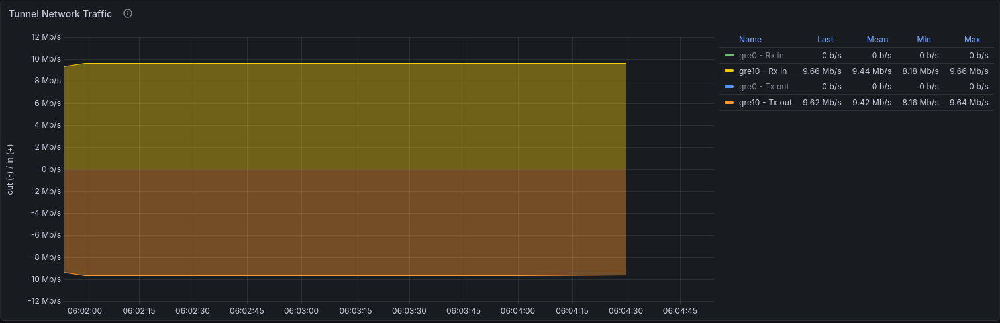
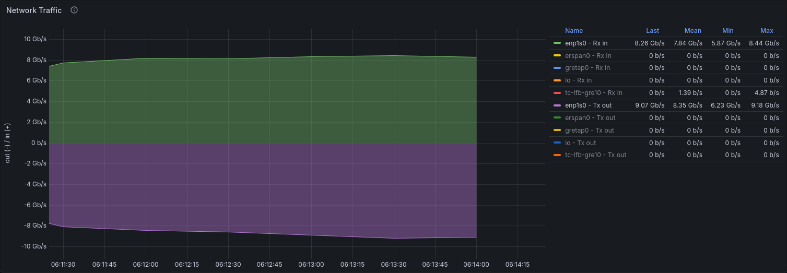

# ddg-test-task

## Сначала прочти меня

Для запуска виртуальных машин используется cloud образ Debian 13 (Trixie), по большей части из-за своей легковесности (около ~400мб), и перед тем, как его использовать, необходимо сгенерировать конфиги `cloud-init` для базовой конфигурации на старте виртуальной машины.

Можно было бы сделать проще? Можно, но стягивать даже минимальный образ Debian 13 занимает 800Мб на диске / vs ~400Мб.

Для генерации `seed.iso` (скомпанованые конфиги `cloud-init` в виде `.iso` файлика, который будем прокидывать внутрь vm через `--cdrom`), необходимо установить утилиту `cloud-localds`. Подробнее об этом расписано ниже.

Чтобы воспользоваться данной утилитой необходимо установить пакет:

1. `cloud-image-utils` для Debian / Ubuntu
2. `cloud-utils` для RHEL, CentOS, Fedora

Также стоит уточнить что в ansible ролях используются 2 функции из стандартных коллекций, а именно:
1. community.general.modprobe - для управления модулями ядра
2. community.docker.docker_compose_v2 - для управления docker compose

эти две коллекции по умолчанию идут "в комплекте" при установке пакета `ansible`, однако если установлен только `ansible-core`, то их придется доставлять отдельно
 
## Запуск проекта

Для запуска виртуалок после клонирования проекта понадобится всего лишь запустить команду

```bash
make provision_vms
```

Данная команда выполнит следующее (необходим `sudo` доступ, а также желательно, чтобы текущий пользователь был в группе `libvirt`):

- Скачает официальный облачный образ Debain 13 (Trixie)
- Создаст временные ssh ключи для доступа к виртуальным машинам
- Создаст отдельную virsh подсеть `iperf-net` с CIDR `192.168.100.0/24`
- Создаст виртуальные машины используя скрипт `provision_vm.sh`

Разберем каждый из шагов по отдельности:

- Первым делом мы скачиваем образ Debian 13 с официальных сорсов, однако, так как этот образ предназначен для облаков, то просто так запустить его не получится. Для работы с ним будем генерировать `cloud-init` конфиги, которые помогут первоначально настроить пользователей, прокинуть ssh ключи, ну и прибить статический ip адрес к vm (в секции с `provision_vm` скриптом ниже).
- Для каждой машины выключен доступ по ssh через пароль для любого пользователя, а также запрещен логин рутовому пользователю (напрямую через ssh), поэтому мы создаем (и после прокидываем в `cloud-init`) временные ssh ключи для пользователя `debian`, который позволит нам получить доступ к vm.
- Отдельная подсеть `192.168.100.0/24` сделана сугубо для избегания коллизии ip адресов, если на хосте уже присутствуют другие запущенные vm в дефолтной virsh подсети `192.168.122.0/24`

`provision_vm` по большому счету просто соединяет конфиги `cloud-init` и после запускает виртуальную машину. _Все шаги, описанные далее, делает скрипт, ниже просто немного распишу его работу._

В нашем примере есть 2 основных `cloud-init` конфига

Для настройки базового пользователя и hardering'а ssh

```bash
#cloud-config
hostname: $VM_NAME

# Disable root login via ssh
disable_root: true

users:
  - name: debian
    sudo: ALL=(ALL) NOPASSWD:ALL
    shell: /bin/bash
    lock_passwd: true
    ssh_authorized_keys:
      - $(cat $TEMP_PUBLIC_KEY_LOCATION)

ssh_pwauth: false # Password authentication off
write_files:
  - path: /etc/ssh/sshd_config.d/99-hardening.conf
    content: |
      PasswordAuthentication no
      ChallengeResponseAuthentication no
      PermitRootLogin no
      PubkeyAuthentication yes
    permissions: '0644'

# Restart sshd daemon
runcmd:
  - systemctl restart sshd || systemctl restart ssh
```

и для первоначальной настройки интерфейса

```bash
version: 2
ethernets:
  enp1s0:
    dhcp4: false
    addresses:
      - $VM_IP/24
    gateway4: $GATEWAY
    nameservers:
      addresses: [8.8.8.8, 1.1.1.1]
```

После того как эти конфиги шаблонизируются мы можем объединить их вместе в `seed.iso`, который уже прокинем через `--cdrom` внутрь виртуальных машин.

Сам же `seed.iso` можно сгенерировать используя утилиту `cloud-localds`

```bash
cloud-localds "$SEED_DIR/$VM_NAME-seed.iso" \
  "$USERDATA_DIR/$VM_NAME-user-data.yaml" \
  --network-config "$NET_DIR/$VM_NAME-network.yaml" \
  "$USERDATA_DIR/$VM_NAME-meta-data.yaml"
```

_Все сгенерированные конфиги, а также временные ssh ключи хранятся в директории build/_

После того как виртуалки поднимутся мы сможем получить к ним доступ через ssh используя наши временные ssh ключи, тоесть

```bash
ssh -i build/temp_rsa_key debian@192.168.100.101
```

Все остальные действия а именно: установка докера, iperf3 сервера, monitoring стека (Prometheus & Grafana), node_exporter'а, конфигурирование интерфейсов, nftables, ограничение пропускной способности через tc выполнены через ansible

---

Выдавать статические адреса мы начинает с 100 адреса 4 оклета, те начиная с `192.168.100.100`

Итого ip план и inventory для ansible у нас получается следующий:

```
[iperf-computes]
iperf-compute-1 ansible_host=192.168.100.101
iperf-compute-2 ansible_host=192.168.100.102

[monitoring-computes]
monitoring-compute-1 ansible_host=192.168.100.103
```

а также сюда мы берем 2 адреса с `10.0.96.100/30` для создания gre интерфейсов. Стоит уточнить, что мы имеем дело с GRE over IPsec, так как gre не умеет шифровать пакеты.

Для gre интерфесов был выбран mtu 1400 по следующим соображениям:
1. 1500 (default) - 4 (gre overhead) - 52 (ipsec transport mode overhead) = 1444 + мы оставляем небольшой gap обеспечивая себя чтобы размер конечного пакета не превышал MTU и не вызывал fragmentation. Итого mtu = 1400
2. Также в nftables для gre интерфейса установлен [TCP MSS clamping чтобы автоматически высчитывать нужный MSS](https://github.com/fayvori/ddg-test-task/blob/ddg-0000-add-readme/ansible/group_vars/iperf-computes#L35-L36)

## Прокатка и тестирования

После разворачивания виртуальных машин можем переходить к делу. Для прокати всех ролей провалимся в директорию `ansible`, и уже там запустим утилиту `ansible-playbook`

```bash
cd ansible && ansible-playbook --key-file ../build/temp_rsa_key -u debian -i inventory.ini site.yml
```

После успешной прокатки можем провалиться на любой из `iperf-computes` хостов и погонять там трафик через iperf

Для демонстрации возьму хост iperf-compute-2 с ip адресом `192.168.100.102`

Провалимся в него через ssh

```bash
ssh -i build/temp_rsa_key debian@192.168.100.102
```

Попутно с этим можно открыть графину, которая развернута на 3 машине и доступна по адресу `http://192.168.100.103:3000`. Дефолтные креды - `admin:secure_password`

В графане через автоимпорт уже есть дашборд `Network Utilization`, на который мы можем опираться во время тестирования

Запустим iperf3 с опцией `--bidir` на туннельный интерфей скажем на 5 минут чтобы погонять трафик туда-сюда

```bash
@iperf-compute-2$ iperf3 -c 10.0.96.101 --bidir -t 300
```

```
[  5][TX-C] 208.00-209.00 sec  1.38 MBytes  11.5 Mbits/sec    0    591 KBytes
[  7][RX-C] 208.00-209.00 sec  1.25 MBytes  10.5 Mbits/sec
[  5][TX-C] 209.00-210.00 sec  1.38 MBytes  11.5 Mbits/sec    0    591 KBytes
[  7][RX-C] 209.00-210.00 sec  1.12 MBytes  9.44 Mbits/sec
[  5][TX-C] 210.00-211.00 sec   768 KBytes  6.30 Mbits/sec    0    591 KBytes
[  7][RX-C] 210.00-211.00 sec  1.12 MBytes  9.45 Mbits/sec
[  5][TX-C] 211.00-212.00 sec  1.25 MBytes  10.5 Mbits/sec    0    591 KBytes
[  7][RX-C] 211.00-212.00 sec  1.12 MBytes  9.43 Mbits/sec
[  5][TX-C] 212.00-213.00 sec  1.50 MBytes  12.6 Mbits/sec    0    591 KBytes
[  7][RX-C] 212.00-213.00 sec  1.12 MBytes  9.44 Mbits/sec
[  5][TX-C] 213.00-214.00 sec   640 KBytes  5.25 Mbits/sec    0    591 KBytes
[  7][RX-C] 213.00-214.00 sec  1.12 MBytes  9.45 Mbits/sec
[  5][TX-C] 214.00-215.00 sec  1.38 MBytes  11.5 Mbits/sec    0    591 KBytes
[  7][RX-C] 214.00-215.00 sec  1.12 MBytes  9.43 Mbits/sec
[  5][TX-C] 215.00-216.00 sec  1.38 MBytes  11.5 Mbits/sec    0    591 KBytes
[  7][RX-C] 215.00-216.00 sec  1.25 MBytes  10.5 Mbits/sec
[  5][TX-C] 216.00-217.00 sec   640 KBytes  5.24 Mbits/sec    0    591 KBytes
```

После пары-тройки минут prometheus соберет достаточно метрик с node_exporter'а и мы увидим, что трафик упирается в потолок в 10 mbit/s (как и было указано в тз) из-за ограничений наложенных `tc`



Теперь же запустим трафик напрямую

```bash
@iperf-compute-2$ iperf3 -c 192.168.100.101 --bidir -t 300
```

```
[  7][RX-C] 234.00-235.00 sec  1.01 GBytes  8.65 Gbits/sec
[  5][TX-C] 235.00-236.00 sec  1.05 GBytes  9.00 Gbits/sec    1   4.02 MBytes
[  7][RX-C] 235.00-236.00 sec  1.09 GBytes  9.33 Gbits/sec
[  5][TX-C] 236.00-237.01 sec  1.11 GBytes  9.46 Gbits/sec    0   4.02 MBytes
[  7][RX-C] 236.00-237.01 sec  1013 MBytes  8.41 Gbits/sec
[  5][TX-C] 237.01-238.00 sec  1.05 GBytes  9.02 Gbits/sec    0   4.02 MBytes
[  7][RX-C] 237.01-238.00 sec   963 MBytes  8.16 Gbits/sec
[  5][TX-C] 238.00-239.00 sec  1.06 GBytes  9.07 Gbits/sec    0   4.02 MBytes
[  7][RX-C] 238.00-239.00 sec  1.03 GBytes  8.86 Gbits/sec
[  5][TX-C] 239.00-240.00 sec   984 MBytes  8.25 Gbits/sec    3   4.02 MBytes
[  7][RX-C] 239.00-240.00 sec   846 MBytes  7.10 Gbits/sec
[  5][TX-C] 240.00-241.00 sec  1.01 GBytes  8.64 Gbits/sec    0   4.02 MBytes
[  7][RX-C] 240.00-241.00 sec  1.18 GBytes  10.1 Gbits/sec
[  5][TX-C] 241.00-242.00 sec  1.15 GBytes  9.82 Gbits/sec    0   4.02 MBytes
[  7][RX-C] 241.00-242.00 sec  1.02 GBytes  8.71 Gbits/sec
[  5][TX-C] 242.00-243.00 sec  1.13 GBytes  9.76 Gbits/sec    0   4.02 MBytes
[  7][RX-C] 242.00-243.00 sec   950 MBytes  7.99 Gbits/sec
[  5][TX-C] 243.00-244.00 sec  1.09 GBytes  9.37 Gbits/sec    0   4.02 MBytes
```



В этом случае уже видим что никаких ограничений нет, используется максимально доступная скорость сети.
